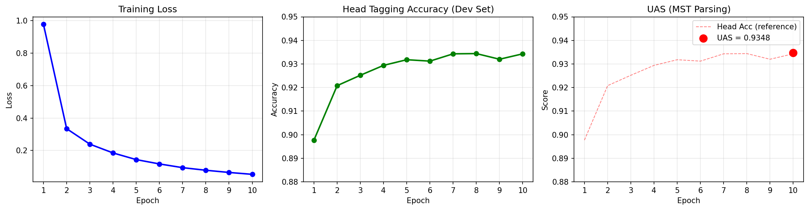

# Dependency Parsing with RoBERTa

## Author
Aziz Baran Kurtulus

## What I Implemented

A neural dependency parser using a biaffine attention mechanism:
- Data loading from Universal Dependencies (en_ewt) with subword tokenization alignment
- Dependency parser model using RoBERTa encoder with biaffine attention for head prediction
- Training loop with wandb logging
- Head tagging accuracy evaluation on dev set
- MST parsing using Chu-Liu-Edmonds algorithm for valid tree prediction
- UAS (Unlabeled Attachment Score) computation

## Requirements

- Python 3.13+
- torch
- transformers
- datasets
- networkx
- wandb
- tqdm
- matplotlib

## Installation

### Option 1: Using UV (recommended)
```bash
uv sync
```

### Option 2: Using pip
```bash
pip install torch transformers datasets networkx wandb tqdm matplotlib
```

## How to Run

```bash
# Using UV
uv run python main.py

# Using pip
python main.py
```

This will:
1. Load and tokenize the English UD dataset (en_ewt)
2. Train the model for 10 epochs
3. Report head tagging accuracy after each epoch
4. Compute final UAS using MST decoding

## Model Architecture

- **Encoder**: RoBERTa-base (768-dim hidden states)
- **Head MLP**: Linear(768, 500) + ReLU
- **Dependent MLP**: Linear(768, 500) + ReLU
- **Biaffine Attention**: Score(i,j) = H_head[i]^T * U1 * H_dep[j] + H_head[i]^T * u2

## Results

| Metric | Value |
|--------|-------|
| Training Loss | 0.0533 |
| Head Tagging Accuracy | 93.44% |
| UAS (MST) | 93.48% |
| Epochs | 10 |
| Batch Size | 32 |

## Learning Curves



## Directory Structure

```
.
|-- README.md
|-- main.py
|-- learning_curves.png
|-- learning_curves_combined.png
|-- pyproject.toml
|-- uv.lock
```
